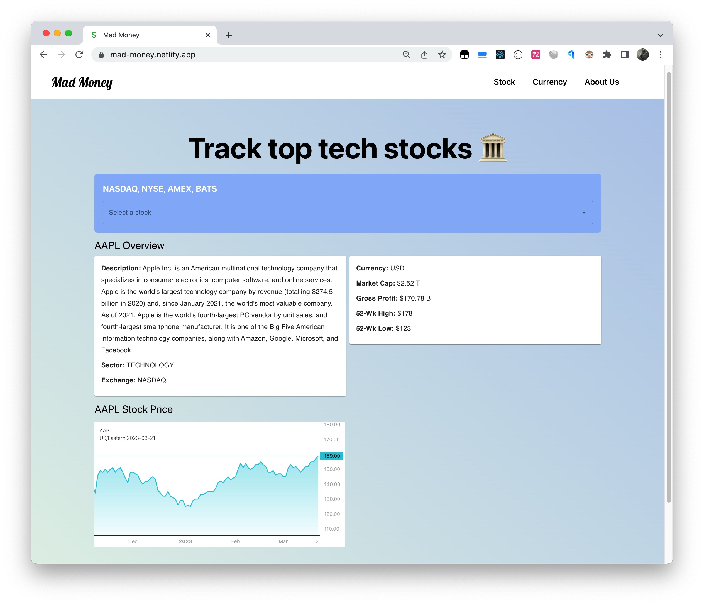
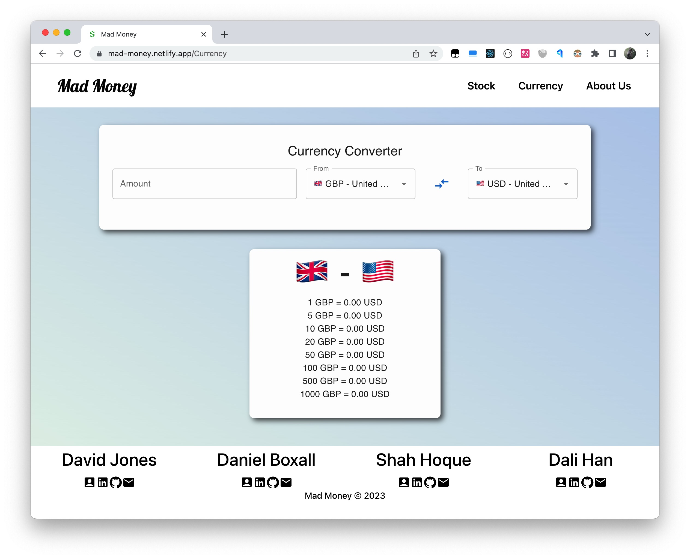
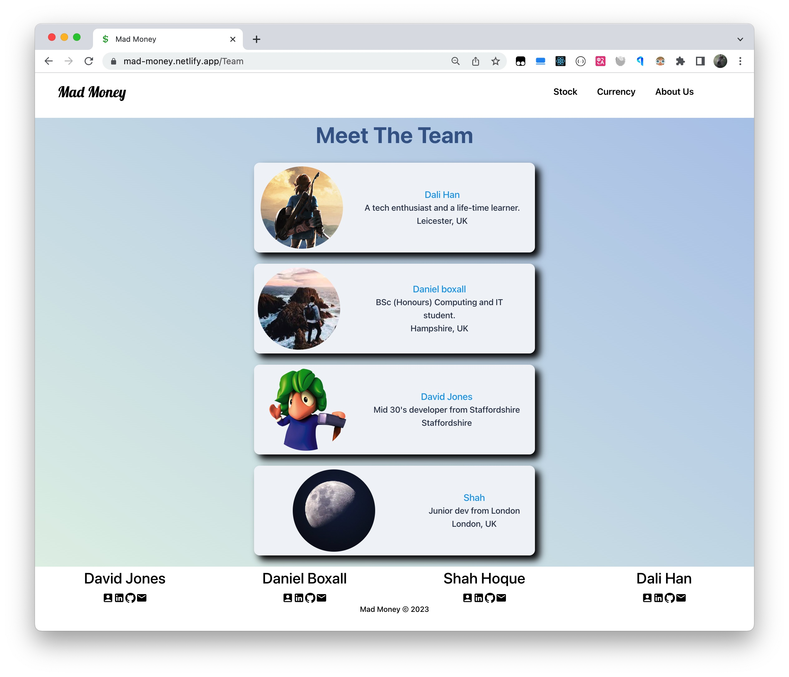

# Mad Money

## Description
A one stop shop for your tech stocks and currency conversions.

## Table of Contents
- [Mad Money](#mad-money)
  - [Description](#description)
  - [Table of Contents](#table-of-contents)
  - [Screenshots](#screenshots)
  - [Installation](#installation)
  - [License](#license)
  - [Contributors](#contributors)
  - [Questions](#questions)

## Screenshots 

  
  
 
 
## Installation
Simply `npm install` and `npm start` to test locally. Open [Mad Money](https://mad-money.netlify.app/) for live demo.

## License
This project is licensed under MIT License.
## Contributors 

 - [DJ-86](https://www.github.com/DJ-86)   
 - [dearbojack](https://www.github.com/dearbojack)   
 - [daniel-boxall](https://www.github.com/daniel-boxall)   
 - [shah-hoque](https://www.github.com/shah-hoque)
  
## Questions
If you have any questions feel free to contact us.
 - [DJ-86](mailto:davidmarkjones86@gmail.com)
 - [dearbojack](mailto:dali4han@gmail.com)
 - [daniel-boxall](mailto:danielboxall07@gmail.com)
 - [shah-hoque](mailto:shah.hoque@hotmail.co.uk)
